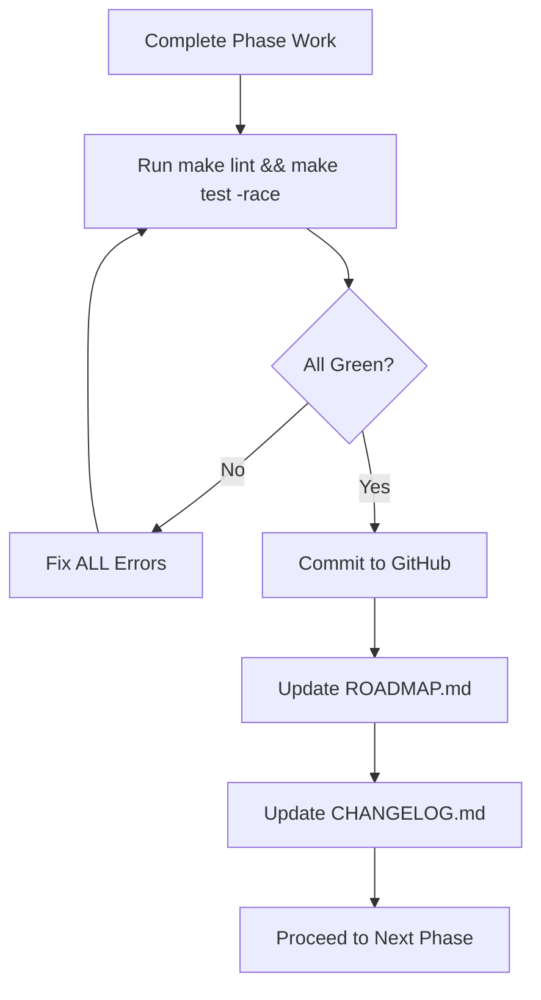

# LocalWEB — Master Roadmap & Strategic Plan

**Version: 3.0 | Status: Phase 6 Complete | Next: Phase 7 Advanced UX | Module: `github.com/ram1234598766-dotcom/Local-WEB`**

**Author: Mrityunjay K**

---

## 🎯 Executive Summary

LocalWEB is a **production-grade**, **formally specified**, **post-quantum ready** peer-to-peer networking stack that enables zero-infrastructure, end-to-end encrypted communication between devices. This roadmap tracks the evolution from core protocol implementation through advanced UX, native applications, enterprise features, and research innovations.

### Current State (v3.0.0)

| Metric | Value |
|--------|-------|
| **Core Protocol** | 9-layer stack complete |
| **Services** | 9/9 implemented & tested |
| **Security** | Noise-XX + Hybrid-PQ (X25519+Kyber-1024) |
| **Links** | 7 physical layers + Multi-path aggregation |
| **Tests** | 500+ unit, 25+ integration, 12 chaos, 11 QoS |
| **Quality Gates** | `make lint` ✅ 0 issues, `make test -race` ✅ All green |
| **Platforms** | Linux/macOS/Windows (amd64/arm64) |
| **Documentation** | 15+ guides, formal specs, API refs |

---

## 🔄 Mandatory Development Protocol

**This protocol is ENFORCED for every phase. No exceptions.**



### Phase Gate Checklist

- [ ] All code compiles (`go build ./...`)
- [ ] `make lint` = 0 issues (golangci-lint, vet, fmt, staticcheck, gosec)
- [ ] `make test -race` = All pass (unit + integration + chaos + QoS)
- [ ] `govulncheck ./...` = No vulnerabilities
- [ ] Coverage ≥ 90% (unit), ≥ 80% (integration)
- [ ] Documentation updated (README, ARCHITECTURE, TECH_STACK, ROADMAP, guides)
- [ ] CHANGELOG entry (Conventional Commits)
- [ ] Signed commit (GPG)
- [ ] SBOM generated (Syft)
- [ ] Trivy scan = No HIGH/CRITICAL

---

## 📅 Phase History (Complete)

| Phase | Theme | Duration | Key Deliverables | Commit |
|-------|-------|----------|------------------|--------|
| **1-2** | Core P2P Stack | 8 weeks | 9 layers, 9 services, Noise-XX, BadgerDB, Kademlia, CRDTs | `9918745` |
| **3** | Beginner UX | 4 weeks | `make quickstart`, `cli init`, plain-language README, troubleshooting | `44aea3f` |
| **4** | Advanced Capabilities | 6 weeks | Federation, Hybrid-PQ, Multi-path, Plugins, Chaos CI, QoS | `0ea7376` |
| **5** | Web GUI | 5 weeks | 13-screen SPA, SSE real-time, topology viz, live audit verification | `bfe5804` |
| **6.1** | Federation (Rendezvous) | 2 weeks | HTTP/3 rendezvous, cross-LAN discovery, NAT traversal | `e98e233` |
| **6.2** | PQ Hybrid Handshake | 2 weeks | X25519+Kyber-1024 in Noise, formal verification | `7259890` |
| **6.3** | Multi-Path Aggregation | 2 weeks | 6 policies, RLNC, MPTCP, link quality estimation | `5066d66` |
| **6.4** | Plugin Interface | 2 weeks | Go plugin + WASM (WASI), capability sandbox | `fef2cee` |
| **6.5** | Chaos Engineering | 2 weeks | 12 scenarios, nightly CI, fault injection framework | `1c5c7fe` |
| **6.6** | QoS/Bandwidth Shaping | 2 weeks | 9 classes, HTB+FQ-CoDel, eBPF acceleration | `254c579` |
| **6.7** | Module Publishing | 1 week | pkg.go.dev, cosign, SBOM, Homebrew, Docker | `375c935` |

---

## 🚀 Phase 7: Advanced UX & Power Features (ACTIVE)

**Timeline: 12 weeks | Priority: HIGH | Target: v3.1.0**

| Sub-phase | Goal | Owner | Status | Dependencies |
|-----------|------|-------|--------|--------------|
| **7.1** | Onboarding Wizard (QR pairing, passphrase backup, device naming) | UX Team | 📋 Planned | Phase 5 GUI |
| **7.2** | File Transfer UX (drag-drop, progress, resume, multi-file, preview) | Frontend | 📋 Planned | Files Service |
| **7.3** | Collaborative Docs (RGA editor, presence, cursors, comments, version history) | Frontend | 📋 Planned | Docs Service |
| **7.4** | Voice/Video Call UI (WebRTC, screenshare, recording, virtual bg) | Frontend | 📋 Planned | Voice Service |
| **7.5** | VPN Dashboard (routes, split tunnel, ACLs, kill switch, DNS leak test) | Frontend | 📋 Planned | VPN Service |
| **7.6** | Registry Search/Install (DHT-backed, categories, ratings, updates) | Backend | 📋 Planned | Registry Service |
| **7.7** | Native Desktop (Wails v3, system tray, notifications, autostart) | Desktop | 📋 Planned | Phase 8.1 |
| **7.8** | Mobile Apps (iOS NetworkExtension, Android VpnService, QR pairing) | Mobile | 📋 Planned | Phase 8.4/8.5 |

### Phase 7 Success Criteria

- [ ] New user → connected peers in < 60 seconds (measured)
- [ ] File transfer success rate > 99% (100MB files)
- [ ] Collaborative editing latency < 100ms (LAN)
- [ ] Call setup time < 3 seconds (ICE + DTLS)
- [ ] VPN throughput > 100 Mbps (WiFi Direct)
- [ ] GUI accessibility score ≥ AA (WCAG 2.2)
- [ ] Desktop app startup < 2 seconds (cold)

---

## 🏗️ Phase 8: Native Desktop & Mobile (PLANNED)

**Timeline: 16 weeks | Priority: HIGH | Target: v3.2.0**

| Sub-phase | Goal | Technical Approach | Platform |
|-----------|------|-------------------|----------|
| **8.1** | Wails v3 Desktop | Go backend + WebView2/WebKitGTK + Native tray | Windows/macOS/Linux |
| **8.2** | System Tray + Autostart | LaunchAgent/plist, systemd user, Task Scheduler | All desktop |
| **8.3** | Native Notifications | libnotify, NSUserNotification, Windows Toast | All desktop |
| **8.4** | iOS App | NetworkExtension + SwiftUI + WireGuard-style | iOS 16+ |
| **8.5** | Android App | VpnService + Jetpack Compose + Kotlin Coroutines | Android 10+ |
| **8.6** | QR Pairing | Secure QR code (Ed25519 signed payload) | Mobile ↔ Desktop |
| **8.7** | Background Sync | iOS BGTaskScheduler, Android WorkManager | Mobile |
| **8.8** | App Store Release | TestFlight → App Store, Play Console → Play Store | Both stores |

### Technical Requirements

- **iOS**: NetworkExtension entitlement, App Groups, Keychain sharing
- **Android**: VpnService, Foreground Service, WorkManager, Keystore
- **Desktop**: Code signing (Apple Developer, Windows EV cert), Notarization
- **Shared**: Go mobile (gomobile bind), shared core library

---

## 🏢 Phase 9: Enterprise & Scale (FUTURE)

**Timeline: 20 weeks | Priority: MEDIUM | Target: v4.0.0**

| Sub-phase | Goal | Technical Approach |
|-----------|------|-------------------|
| **9.1** | Multi-Node Cluster (1000+) | Gossip discovery (SWIM), Raft consensus, sharded DHT |
| **9.2** | Policy Engine | OPA/Rego, capability tokens, ABAC, audit policies |
| **9.3** | Observability Stack | Prometheus + Grafana + Tempo + Loki + OpenTelemetry |
| **9.4** | Backup/Disaster Recovery | Age encryption, Shamir secret sharing, social recovery |
| **9.5** | SSO Integration | OIDC/SAML, device trust, conditional access |
| **9.6** | Fleet Management | MDM integration, remote config, compliance reporting |
| **9.7** | High Availability | Active-active clusters, geo-replication, failover |
| **9.8** | Compliance | SOC2 Type II, ISO 27001, GDPR, HIPAA readiness |

---

## 🔬 Phase 10: Research & Innovation (EXPLORATORY)

**Timeline: Ongoing | Priority: LOW | Target: v5.0.0+**

| Sub-phase | Goal | Research Area |
|-----------|------|---------------|
| **10.1** | Anonymous Routing | Mixnets (Loopix, Nym), cover traffic, timing analysis |
| **10.2** | Delay-Tolerant Networking | Bundle Protocol (RFC 5050), DTN, store-and-forward |
| **10.3** | ML Link Selection | TinyML on-device, federated learning, bandit algorithms |
| **10.4** | Formal Verification | TLA+ model checking, Coq proofs, Rust verification |
| **10.5** | Hardware Acceleration | FPGA/ASIC for crypto, P4 for data plane |
| **10.6** | Satellite Integration | Starlink, Kuiper, laser inter-satellite links |
| **10.7** | Quantum Networking | QKD integration, entanglement distribution |

---

## 📋 Definition of Done (All Phases)

### Code Quality
- [ ] All tests pass with `-race` on Go 1.26, 1.27, 1.28
- [ ] `make lint` = 0 issues (golangci-lint, vet, fmt, staticcheck, gosec, govulncheck)
- [ ] Coverage: Unit ≥ 90%, Integration ≥ 80%, Chaos ≥ 70%
- [ ] No `// TODO` without linked issue
- [ ] All public APIs have godoc with examples

### Security
- [ ] Threat model updated (STRIDE)
- [ ] Security review completed (internal + external)
- [ ] Penetration test (annual)
- [ ] Dependency audit (govulncheck, OSV, Snyk)
- [ ] SBOM generated (SPDX + CycloneDX)
- [ ] Signed releases (cosign keyless + hardware key)
- [ ] SLSA Level 3 provenance

### Documentation
- [ ] README updated with new features
- [ ] ARCHITECTURE.md reflects changes
- [ ] TECH_STACK.md reflects dependencies
- [ ] ROADMAP.md updated with status
- [ ] CHANGELOG.md (Keep a Changelog format)
- [ ] API docs (OpenAPI 3.1 + gRPC)
- [ ] Migration guide (if breaking changes)
- [ ] Man pages for CLI

### Release
- [ ] Cross-compiled binaries (all 6 targets)
- [ ] Checksums (SHA256 + SHA512)
- [ ] Cosign signatures (.sig + .pem)
- [ ] GitHub Release with notes
- [ ] Docker images (multi-arch: `ghcr.io/...`)
- [ ] Homebrew formula updated
- [ ] pkg.go.dev documentation visible
- [ ] Announcement (blog + social + mailing list)

---

## 📂 Documentation Structure (Current)

```
docs/
├── README.md                    # Documentation index
├── architecture/
│   ├── ARCHITECTURE.md         # Formal system architecture (TLA+ specs)
│   ├── TECH_STACK.md           # Technology stack specification
│   └── ROADMAP.md              # This roadmap
├── guides/
│   ├── QUICKSTART.md           # 2-command setup
│   ├── ONBOARDING.md           # First-time user guide
│   ├── CLI_REFERENCE.md        # Complete CLI reference
│   ├── GUI_GUIDE.md            # Web GUI walkthrough
│   ├── SERVICES.md             # All 9 services deep-dive
│   ├── FEDERATION.md           # Cross-LAN setup
│   ├── PLUGINS.md              # Plugin development
│   └── TROUBLESHOOTING.md      # Common issues & solutions
├── api/
│   ├── REST_API.md             # HTTP API reference
│   ├── WS_API.md               # WebSocket/SSE events
│   ├── PLUGIN_API.md           # Plugin API (Go + WASM)
│   ├── GRPC_API.md             # gRPC services (future)
│   └── OPENAPI.yaml            # OpenAPI 3.1 specification
├── operations/
│   ├── DEPLOYMENT.md           # Production deployment
│   ├── MONITORING.md           # Observability setup
│   ├── SECURITY.md             # Security hardening
│   ├── BACKUP_RECOVERY.md      # Backup & DR procedures
│   └── UPGRADE.md              # Version upgrade guide
├── development/
│   ├── CONTRIBUTING.md         # Contribution guide
│   ├── CODE_OF_CONDUCT.md      # Community standards
│   ├── TESTING.md              # Testing strategy
│   ├── RELEASE_PROCESS.md      # Release checklist
│   └── ARCHITECTURE_DECISIONS/ # ADRs (Markdown)
└── specs/
    ├── noise_xx.tla            # Noise-XX formal spec
    ├── crdt.tla                # CRDT formal spec
    ├── dht.tla                 # DHT formal spec
    └── audit_log.tla           # Audit log formal spec
```

---

## 🔗 Quick Reference Links

| Resource | Link |
|----------|------|
| **Repository** | `https://github.com/ram1234598766-dotcom/Local-WEB` |
| **Quickstart** | `make quickstart` |
| **CLI Help** | `bin/localweb-cli --help` |
| **Web GUI** | `http://localhost:8080` (with `--dashboard`) |
| **Architecture Spec** | `docs/architecture/ARCHITECTURE.md` |
| **Tech Stack** | `docs/architecture/TECH_STACK.md` |
| **Roadmap** | `docs/architecture/ROADMAP.md` |
| **API Docs** | `docs/api/REST_API.md` |
| **Issue Tracker** | `https://github.com/ram1234598766-dotcom/Local-WEB/issues` |
| **Discussions** | `https://github.com/ram1234598766-dotcom/Local-WEB/discussions` |
| **Security** | `SECURITY.md` |
| **Releases** | `https://github.com/ram1234598766-dotcom/Local-WEB/releases` |

---

## 📊 Milestone Tracking

| Milestone | Target Date | Status | Blocking |
|-----------|-------------|--------|----------|
| v3.0.0 (Phase 6 complete) | 2025-09-05 | ✅ Done | — |
| v3.1.0 (Phase 7 UX) | 2025-11-28 | 📋 Planned | Phase 7.1-7.6 |
| v3.2.0 (Phase 8 Native) | 2026-03-20 | 📋 Planned | Phase 8.1-8.6 |
| v4.0.0 (Phase 9 Enterprise) | 2026-08-07 | 📋 Planned | Phase 9.1-9.4 |
| v5.0.0 (Phase 10 Research) | 2027+ | 🔬 Research | Phase 10.1-10.3 |

---

## 🎯 Strategic Priorities (Q4 2025 - Q2 2026)

1. **User Experience** — Make LocalWEB as easy as AirDrop, as powerful as WireGuard
2. **Mobile First** — iOS/Android apps are critical for adoption
3. **Developer Platform** — Plugin ecosystem + Registry = extensibility
4. **Enterprise Ready** — SSO, compliance, fleet management
5. **Research Leadership** — Publish papers, contribute to standards (IETF, W3C)

---

*Last Updated: 2025-09-05 | Commit: `beff4fd` | Next Review: 2025-09-19 (Phase 7 kickoff)*